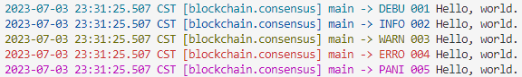
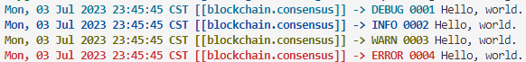
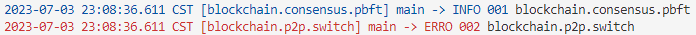

# 日志模块

## Init 初始化日志记录器的接口

### 说明

`Init` 接口只接受一个 `Config` 类型的参数作为输入，`Config` 是一个结构体，它的定义如下所示：

```go
type Config struct {
	Format  string
	LogSpec string
	Writer  io.Writer
}
```

注意，`Config.Format` 定义日志输出的格式，默认的格式如下所示：

<center>%{color}%{time:2006-01-02 15:04:05.000 MST} [%{module}] %{shortfunc} -> %{level:.4s} %{sequence:03x}%{color:reset} %{message}</center>

接下来依次对上述格式进行介绍，首先是 `%{color}`，在解析到它时，实际上会实例化一个 `ColorFormatter`，它的作用就是在输出日志信息时，它会根据不同的日志级别为日志信息着对应的颜色，例如 `Error` 信息会被附着上红色。其次是 `{time:2006-01-02 15:04:05.000 MST}`，在解析到它时会实例化一个 `TimeFormatter`，`time:` 后面跟了一串字符串，用来设置时间的打印格式。再其次是 `[%{module}]`，在解析到它时会实例化一个 `ModuleFormatter`，它用来输出日志记录器的名字，注意，这里多了一对中括号，实际上，这对中括号会被解析为 `StringFormatter`，它的作用就是原封不动的输出中括号（所遇到的任何字符串）。接着是 `%{shortfunc}`，遇到它时，会解析得到一个 `ShortfuncFormatter`，它的作用就是在输出日志信息时，会输出是哪个函数输出的该条日志信息。接着是 `%{sequence:03x}`，遇到它时，会解析得到一个 `SequenceFormatter`，它的作用是输出日志的序号，每输出一条日志，序号就会累增 `1`。接着遇到的 `%{color:reset}` 会解析得到一个 `ColorFormatter`，它的作用不同于前面的 `ColorFormatter`，它是用来取消给日志上色的。`%{message}` 会实例化一个 `MessageFormatter`，它的作用就是用来输出日志信息。

一个日志输出的例子如下图所示：



`Config.LogSpec` 的用法将在 **ActivateSpec - 定义模块日志级别的接口** 这一节进行介绍。

### 案例介绍

我们在测试 `Init` 之前需要先导入对应的包：`github.com/geistwelt/quarkx/common/qlogging`。

```go
package main

import (
    "github.com/geistwelt/quarkx/common/qlogging"
)

func main() {
    format := `%{color:bold}%{time:Mon, 02 Jan 2006 15:04:05 MST} [[%{module}]] -> %{level} %{sequence:04x}%{color:reset} %{message}`
    cfg := qlogging.Config{
        Format: format,
        LogSpec: "blockchain.consensus=debug:blockchain=error:warn",
    }

    qlogging.Init(cfg)
    qxl := qlogging.MustGetLogger("blockchain.consensus")
    qxl.Debug("Hello, world.")
	qxl.Info("Hello, world.")
	qxl.Warn("Hello, world.")
	qxl.Error("Hello, world.")
}
```

上述代码的执行结果如下图所示：



## ActivateSpec - 定义模块日志级别的接口

### 说明

`ActivateSpec` 接口只接受一个字符串作为输入参数，该字符串有格式要求，格式如下所示：

<center>loggernameA=levelA:loggernameB=levelB:defaultlevel</center>

对该格式所表示的含义的解释是：日志记录器 `loggernameA` 的日志级别为 `levelA`，例如是 `InfoLevel`，那么低于 `InfoLevel` 级别的日志，日志记录器 `loggernameA` 都不会输出。同理，`loggernameB` 也是如此。`defaultlevel` 表示默认日志级别，也就是说，我们没有通过等号显式设置日志级别的日志记录器将遵守 `defaultlevel` 输出日志，例如 `defaultlevel` 等于 `ErrorLevel` 的话，由于 `loggernameC` 日志记录器的日志级别未被显式设置，那么 `loggernameC` 将只能输出级别大于或等于 `ErrorLevel` 的日志。

格式中，`loggernameA` 即日志模块记录器的名字，它也有格式要求，如下所示：

<center>loggernameA1.loggernameA2.loggernameA3.[...]</center>

之所以对日志模块记录器的名字的格式做要求，是因为我们考虑到了以下这种情况：我们设置了一个名为 `p2p` 的日志记录器模块，顾名思义 `p2p` 是与通信网络相关的，那么跟网络相关的模块可能还有地址簿 `addrbook`。`p2p` 与 `addrbook` 的从属关系可以认为 `addrbook` 属于 `p2p`，所以与 `addrbook` 相关的日志记录器模块的命名规则应当是 `p2p.addrbook`。如果我们只显式设置了 `p2p` 的日志级别，将来我们新建一个名为 `p2p.addrbook` 的日志记录器，那么该日志记录器将会沿用 `p2p` 日志记录器的日志级别。

### 案例介绍

我们在测试 `ActivateSpec` 之前需要先导入对应的包：`github.com/geistwelt/quarkx/common/qlogging`。

```go
package main

import (
    "github.com/geistwelt/quarkx/common/qlogging"
)

func main() {
    spec := "blockchain.consensus=info:blockchain=error:warn"
    qlogging.ActivateSpec(spec)

    qxl := qlogging.MustGetLogger("blockchain.consensus.pbft")
    qxl.Debug("blockchain.consensus.pbft")  // 不会输出
    qxl.Info("blockchain.consensus.pbft")   // 正常输出

    qxl = qlogging.MustGetLogger("blockchain.p2p.switch")
    qxl.Info("blockchain.p2p.switch")       // 不会输出
    qxl.Error("blockchain.p2p.switch")      // 正常输出
}
```

上述代码的执行结果如下图所示：


